# Amplify

Amplify is an open-source app created for users to take the initiative in being part of an actionable step in the efforts to protect against climate change. The user is able to choose a climate campaign, then using their zip code, they will be able to select a representative of their choice. The user then donates to have their letter sent out by Amplify.


## Table of Contents

  * [Getting Started](#getting-started)
  * [Project Setup](#project-setup)
  * [Customize configuration](#customize-configuration)
  * [App Walkthrough](#app-walkthrough)
  
## Getting Started

This repo contains both the frontend and backend portions of the Amplify application.

The frontend code is stored in the `src/` directory.

The backend (API) code is stored in the `server/` directory.

**Project Workflow:**

[Enablement Deck](https://docs.google.com/presentation/d/1llJgeTU1EzRSYB8kL-IQeAdoq7p6xb4ApEac5E3M8Qo/edit?usp=sharing)


- [Overall Project Board](https://github.com/ProgramEquity/amplify/projects?type=beta)
- [Feature Breakdown](https://github.com/ProgramEquity/amplify/discussions/62)
- [OSS Architecture](https://github.com/ProgramEquity/amplify/discussions/61)
- [Wiki](https://github.com/ProgramEquity/amplify/wiki): API methods, Data Structures

**Resources:**
- We meet every **Wednesday from 12-1 p.m. PT and Thursdays from 8-8:30 p.m. PT**. Sign up for an [orientation](https://forms.gle/4miQJ8ccuWdeJha16)
- Try out our [demo](https://www.figma.com/file/46c9cmuTiCpFA4DHB8OK0H/Amplify-User-Interface-%2B-Design-Guide?node-id=1585%3A653) or review [App Research](https://www.notion.so/programequity/Dare-to-Dream-Civic-Engagement-is-key-to-change-595ca4db3a2948c6b44569b58d530c8c)

# Project setup
In order to get started, you can clone, download a ZIP, or fork this repository to work on your local machine. If you would like to get started with Codespaces instead, the video below will walk you through setting up your Codespace.

https://user-images.githubusercontent.com/9143339/159093687-6fc90733-0599-445c-b08b-a6378d988e4b.mov

<b>Codespaces Set Up</b>

## Contributing
Would you like to become a contributor? Please check out our [contributors guide](./CONTRIBUTING.md)! 💝

Run the following script first:
```shell
script/bootstrap
```

You will need to copy the `.env.example` file to a `.env` file in this repo. You can use the following command in your terminal:
```shell
cp .env.example .env
```

### Compiles and hot-reloads full app for development
```shell
npm run dev
```

### Compiles and minifies for production
```shell
npm run build
```

### Lints and fixes files
```shell
npm run lint
```

### Runs Prettier and fixes files
```shell
npm run format
```

### Build and run as if in prod
```shell
npm start
```

### Customize configuration
See [Configuration Reference](https://cli.vuejs.org/config/).

# App Walkthrough

**App Structure**

Current Structure:


Goal Structure:


**User Journey:**

https://user-images.githubusercontent.com/9143339/159093855-c01e1d77-0d6a-4f6e-b691-81491830001a.mp4


# FlowChart of Folders and Files

```mermaid
flowchart LR 
    
    A[.devcontainer] --- A1[Dockerfile]    
    A --- A2[devcontainer.json]
    A --- A3[docker-compose.yml]
    A --- A4[first-run-notice.txt]
    A --- A5[on-create-command.sh]
    A --- A6[post-create-command.sh]
    


    B[.github] --- B1[ISSUE_TEMPLATE]    
    B --- B2[workflows]
    B --- B3[CODEOWNERS]
    B --- B4[dependabot.yml]
    B --- B5[mention-to-slack.yml]

    B1 --- B1A[backend-onboarding.md]
    B1 --- B1B[batch-templade.md]
    B1 --- B1C[bug.md]
    B1 --- B1D[design issue.md]
    B1 --- B1E[frontend-onboarding.md]
    B1 --- B1F[new-feature.md]
    
    B2 --- B2A[action-cats.yml]
    B2 --- B2B[build.yml]
    B2 --- B2C[cats.yml]
    B2 --- B2D[check-formatting.yml]
    B2 --- B2E[codeql-analysis.yml]
    B2 --- B2F[emojiPR.yml]
    B2 --- B2G[finish-hackpod.yml]
    B2 --- B2H[integration-tests.yaml]
    B2 --- B2I[issue-metrics.yml]
    B2 --- B2J[labeler.yml]
    B2 --- B2K[lint.yml]
    B2 --- B2L[pr-metrics.yml]
    B2 --- B2M[programequity_slack.yml]
    B2 --- B2O[scorecards-analysis.yml]
    B2 --- B2P[unit-tests.yml]
    B2 --- B2Q[welcome_message.yml]
    B2 --- B2R[workflow-lint.yml]



    C[.husky] --- C1[pre-commit]



    D[docs] --- D1[_config.yml]
    D --- D2[test.md]



    E[public] --- E1[Campaigns]
    E --- E2[android-chrome-192x192.png]
    E --- E3[android-chrome-256x256.png]
    E --- E4[apple-touch-icon.png]
    E --- E5[browserconfig.xml]
    E --- E6[favicon-16x16.png]
    E --- E7[favicon-32x32.png]
    E --- E8[favicon.ico]
    E --- E9[favicon.png]
    E --- E10[index.html]
    E --- E11[mstile-150x150.png]
    E --- E12[safari-pinned-tab.svg]
    E --- E13[site.webmanifest]
    
    E1 --- E1A[Clean Futures Act.png]
    E1 --- E1B[Climate Leadership and Community Protection Act.png]
    E1 --- E1C[Climate and Community Investment Act.png]
    E1 --- E1D[Energy Efficiency, Equity and Jobs.png]
    E1 --- E1E[Green New Deal for New York Act.png]
    E1 --- E1F[Proposed Actions on EJ Communities.png]
    E1 --- E1G[test.md]
    

    
    F[roiScript] --- F1[issue-metrics.mjs]
    F --- F2[issue_timestamp.log]
    F --- F3[log-branch.mjs]
    F --- F4[package.json]
    F --- F5[send-metrics.mjs]
    

    
    G[script] --- G1[bootstrap]
    G --- G2[create-db.js]
    G --- G3[drop-db.js]
    

    
    H[server] --- H1[__tests__]
    H --- H2[auth]
    H --- H3[db]
    H --- H4[lib]
    H --- H5[routes/api]
    H --- H6[utilities]
    H --- H7[api.js]
    H --- H8[apiResponse.js]
    H --- H9[app.js]
    H --- H10[ciceroResponse.js]
    H --- H11[server.js]
    
    H1 --- H1A[integration]
    H1 --- H1B[unit]

    H1A --- H1A1[server/routes/api/v1/campaigns]
    H1A --- H1A2[axios-cache-interceptor.test.js]
    H1A --- H1A3[checkout.test.js]
    H1A --- H1A4[lob.test.js]
    H1A --- H1A5[representatives.test.js]
    
    H1A1 --- H1A1A[campaign_put_endpoint.test.js]
    
    H1B --- H1B1[event_logger.test.js]

    H2 --- H2A[config]
    H2 --- H2B[messages]
    H2 --- H2C[check-jwt.js]

    H2A --- H2A1[env.dev.js]

    H2B --- H2B1[messages.service.js]

    H3 --- H3A[migrations]
    H3 --- H3B[models]
    H3 --- H3C[seeds/development]
    H3 --- H3D[_migration.stub.js]
    H3 --- H3E[_seed.stub.js]
    H3 --- H3F[index.js]
    H3 --- H3G[util.js]
    
    H3A --- H3A1[20210513215151_create-campaigns-table.js]
    H3A --- H3A2[20210514142754_create-volunteeers-table.js]
    H3A --- H3A3[20210514145630_create-letter-versions-table.js]
    H3A --- H3A4[20210514201314_create-sent-letters-table.js]
    H3A --- H3A5[20210729053119_create-transactions-table.js]
    H3A --- H3A6[20210729063333_create-variants-table.js]
    H3A --- H3A7[20211222210238_match-production-campaigns-table.js]
    H3A --- H3A8[20211224223012_match-production-volunteers-table.js]
    H3A --- H3A9[20211224223204_match-production-letter_versions-table.js]
    H3A --- H3A10[20211230165803_harden-campaigns-table.js]
    H3A --- H3A11[20211230165819_harden-volunteers-table.js]
    H3A --- H3A12[20211230165827_harden-letter_versions-table.js]
    H3A --- H3A13[20220227142912_add-campaign-fields.js]
    H3A --- H3A14[20220413154827_rename-volunteers-table-to-constituents.js]
    H3A --- H3A15[20220420234746_letter_versions-office_division-constraints.js]
    H3A --- H3A16[20220425034702_remove-campaigns-letters_counter.js]
    H3A --- H3A17[20230301220841_create-error_logs-table.js]
    H3A --- H3A18[20230309195953_update-campaign-model.js]
    H3A --- H3A19[20231204193051_create-admins-table.js]
   
    H3B --- H3B1[_base.js]
    H3B --- H3B2[admin.js]
    H3B --- H3B3[campaign.js]
    H3B --- H3B4[error_log.js]
    H3B --- H3B5[letter-version.js]

    H3C --- H3C1[seed-admins-table.js]
    H3C --- H3C2[seed-campaigns-table.js]
    H3C --- H3C3[seed-letter_versions-table.js]

    H4 --- H4A[encrypt.js]

    H5 --- H5A[v1]
    H5 --- H5B[authentication.js]
    H5 --- H5C[campaigns.js]
    H5 --- H5D[checkout.js]
    H5 --- H5E[event_logger.js]
    H5 --- H5F[letter_versions.js]
    H5 --- H5G[lob.js]
    H5 --- H5H[representatives.js]
    H5 --- H5I[twilio.js]
    
    H5A --- H5A1[campaigns]
    H5A --- H5A2[v1.js]

    H5A1 --- H5A1A[index.js]

    H6 --- H6A[winston_logger.js]



    I[src] --- I1[assets]
    I --- I2[auth]
    I --- I3[components]
    I --- I4[configs]
    I --- I5[plugins]
    I --- I6[router]
    I --- I7[store]
    I --- I8[styles]
    I --- I9[utilities]
    I --- I10[views]
    I --- I11[.eslintrc.json]
    I --- I12[App.vue]
    I --- I13[main.js]
    I --- I14[registerServiceWorker.js]

    I1 --- I1A[images]
    I1 --- I1B[logo]
    I1 --- I1C[scm]

    I1A --- I1A1[Large Hero Banner.png]
    I1A --- I1A2[Ohlone-village1.jpeg]
    I1A --- I1A3[SOGOREA-TE-LAND-TRUS.jpeg]
    I1A --- I1A4[Screen Shot 2022-11-22 at 12.57.10 AM.png]
    I1A --- I1A5[StepsGraphic.png]
    I1A --- I1A6[amplify-web-3.png]
    I1A --- I1A7[amplifysumm.png]
    I1A --- I1A8[cardimage.jpeg]
    I1A --- I1A9[mailbox.png]
    I1A --- I1A10[shellmound.jpeg]

    I1B --- I1B1[Amplify-Email.png]
    I1B --- I1B2[Amplify-Newsletter-Horizontal-RGB.jpg]
    I1B --- I1B3[Amplify-Newsletter-Horizontal-RGB.png]
    I1B --- I1B4[Amplify-Newsletter-Horizontal-RGB.svg]
    I1B --- I1B5[Amplify-Newsletter-Vertical-RGB.jpg]
    I1B --- I1B6[Amplify-Newsletter-Vertical-RGB.png]
    I1B --- I1B7[Amplify-Newsletter-Vertical-RGB.svg]
    I1B --- I1B8[Amplify-Website-Horizontal-RGB.jpg]
    I1B --- I1B9[Amplify-Website-Horizontal-RGB.png]
    I1B --- I1B10[Amplify-Website-Horizontal-RGB.svg]
    I1B --- I1B11[Amplify-Website-Vertical-RGB.jpg]
    I1B --- I1B12[Amplify-Website-Vertical-RGB.png]
    I1B --- I1B13[Amplify-Website-Vertical-RGB.svg]

    I1C --- I1C1[images]
    I1C --- I1C2[text]

    I1C1 --- I1C1A[campaign-background.webp]
    I1C1 --- I1C1B[campaign-img-1.webp]
    I1C1 --- I1C1C[campaign-img-2.webp]
    I1C1 --- I1C1D[campaign-img-3.webp]
    I1C1 --- I1C1E[campaign-logo.webp]

    I1C2 --- I1C2A[text.json]
    
    I2 --- I2A[auth0-plugin.js]

    I3 --- I3A[0-DO-NOT-NAME-FILE.md]
    I3 --- I3B[1-IN-THIS-DIR.md]
    I3 --- I3C[2-WITH-LOWER-CASE.md]
    I3 --- I3D[ActionComplete.vue]
    I3 --- I3E[AppFooter.vue]
    I3 --- I3F[AppHeader.vue]
    I3 --- I3G[AuthNav.vue]
    I3 --- I3H[AuthenticationButton.vue]
    I3 --- I3I[CampaignBlurb.vue]
    I3 --- I3J[CampaignCard.vue]
    I3 --- I3K[CampaignCards.vue]
    I3 --- I3L[CampaignHero.vue]
    I3 --- I3M[CauseCarousel.vue]
    I3 --- I3N[DonateMoney.vue]
    I3 --- I3O[HomeHero.vue]
    I3 --- I3P[LetterLoad.vue]
    I3 --- I3Q[LoginButton.vue]
    I3 --- I3R[LogoutButton.vue]
    I3 --- I3S[RepresentativeCard.vue]
    I3 --- I3T[SearchReps.vue]
    I3 --- I3U[SignName.vue]
    I3 --- I3V[SignupButton.vue]
    I3 --- I3W[TakeAction.vue]
    
    I4 --- I4A[theme.js]

    I5 --- I5A[vuetify.js]

    I6 --- I6A[index.js]
    I6 --- I6B[scroll-behavior.js]

    I7 --- I7A[index.js]

    I8 --- I8A[global.less]

    I9 --- I9A[vue_logger.js]

    I10 --- I10A[0-DO-NOT-NAME-FILE.md]
    I10 --- I10B[1-IN-THIS-DIR.md]
    I10 --- I10C[2-WITH-LOWER-CASE.md]
    I10 --- I10D[About.vue]
    I10 --- I10E[Campaign.vue]
    I10 --- I10F[CompletePage.vue]
    I10 --- I10G[Home.vue]
    

    
    J[util] --- J1[format.js]
    J --- J2[validate.js]



    K[.env.example]



    L[.eslintrc.json]



    M[.gitignore]



    N[.node-version]



    O[.prettierignore]



    P[.prettierrc]



    Q[AmplifyApp.md]



    R[Brewfile]



    S[CHECKOUT.MD]



    T[CODE_OF_CONDUCT.md]



    U[CONTRIBUTING.md]



    V[LICENSE]



    W[README.md]



    X[Renewable Capitol Act.png]



    Y[SECURITY.md]




    Z[auth_config.json]



    AA[babel.config.js]
```

